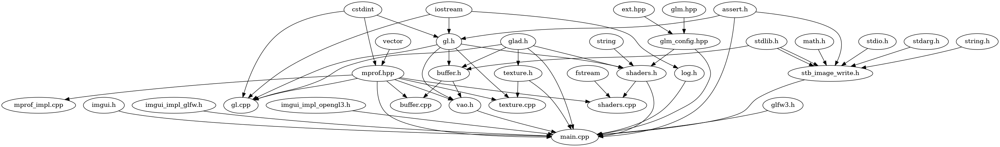

# cdepviz
Visualize dependencies in a C/C++ project

## Usage
Given a directory containing source/header files *dir/*, and one (or more) directory *dir/exclude/* to be excluded from search, 
**cdepviz** will generate *output.dot*, containing graph information for Graphviz.
```console
python3 cdepviz.py dir/ -e dir/exclude
dot -Tpng output.dot -o output.png
```
## Example
